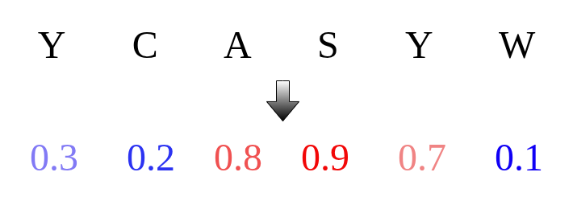

<h1 align="center">
  
</h1>

**Paraplume** is a sequence-based paratope prediction method. It predicts which amino acids in an antibody sequence are likely to interact with an antigen during binding. Concretely, given an amino acid sequence, the model returns a **probability for each residue** indicating the likelihood of antigen interaction.

<h1 align="center">
  
</h1>

---

<details>
<summary><h1>📖 How it works</h1></summary>

Paraplume uses supervised learning and involves three main steps:

1. **Labelling**:
   Antibody sequences are annotated with paratope labels using structural data from [SAbDab](http://opig.stats.ox.ac.uk/webapps/newsabdab/).

2. **Sequence representation**:
   Each amino acid is embedded into a high-dimensional vector using **Protein Language Model (PLM) embeddings**.

3. **Model training**:
   A **Multi-Layer Perceptron (MLP)** is trained to minimize **Binary Cross-Entropy Loss**, using PLM embeddings as inputs and paratope labels as targets.

The full workflow of Paraplume is summarized Figure B below:


</details>

---

<details>
<summary><h1>⚙️ Installation</h1></summary>

It is available on PyPI and can be installed through pip.

```bash
pip install paraplume
```

We recommend installing it in a virtual environment with python >= 3.10.

</details>

---

<details>
<summary><h1>💻 Command Line Documentation</h1></summary>

A command-line tool for predicting paratopes from antibody sequences.

### Basic Usage
```bash
infer-paratope [OPTIONS] COMMAND [ARGS]...
```

### Global Options
- `--help` - Show help message and exit

---

<details>
<summary><h2>📋 Commands</h2></summary>

<details>
<summary><h3>1. seq-to-paratope - Predict from Raw Sequences</h3></summary>

Predict paratope directly from amino acid sequences provided as command line arguments.

#### Usage
```bash
infer-paratope seq-to-paratope [OPTIONS]
```

#### Options
| Option | Type | Default | Description |
|--------|------|---------|-------------|
| `-h, --heavy-chain` | TEXT | - | Heavy chain amino acid sequence |
| `-l, --light-chain` | TEXT | - | Light chain amino acid sequence |
| `--custom-model` | PATH | None | Path to custom trained model folder |
| `--gpu` | INT | 0 | GPU device to use |
| `--large/--small` | flag | --large | Model size (large: full Paraplume, small: ESM-2 only) |

<details>
<summary><h4>Examples</h4></summary>

**Both chains:**
```bash
infer-paratope seq-to-paratope \
  -h QAYLQQSGAELVKPGASVKMSCKASDYTFTNYNMHWIKQTPGQGLEWIGAIYPGNGDTSYNQKFKGKATLTADKSSSTAYMQLSSLTSEDSAVYYCASLGSSYFDYWGQGTTLTVSS \
  -l EIVLTQSPTTMAASPGEKITITCSARSSISSNYLHWYQQKPGFSPKLLIYRTSNLASGVPSRFSGSGSGTSYSLTIGTMEAEDVATYYCHQGSNLPFTFGSGTKLEIK
```

**Heavy chain only:**
```bash
infer-paratope seq-to-paratope \
  -h QAYLQQSGAELVKPGASVKMSCKASDYTFTNYNMHWIKQTPGQGLEWIGAIYPGNGDTSYNQKFKGKATLTADKSSSTAYMQLSSLTSEDSAVYYCASLGSSYFDYWGQGTTLTVSS
```

**Light chain only:**
```bash
infer-paratope seq-to-paratope \
  -l EIVLTQSPTTMAASPGEKITITCSARSSISSNYLHWYQQKPGFSPKLLIYRTSNLASGVPSRFSGSGSGTSYSLTIGTMEAEDVATYYCHQGSNLPFTFGSGTKLEIK
```

</details>

</details>

<details>
<summary><h3>2. file-to-paratope - Predict from File</h3></summary>

Predict paratope from sequences stored in a CSV file.

#### Usage
```bash
infer-paratope file-to-paratope [OPTIONS] FILE_PATH
```

#### Arguments
| Argument | Type | Required | Description |
|----------|------|----------|-------------|
| `FILE_PATH` | PATH | ✓ | Path to input CSV file |

#### Options
| Option | Type | Default | Description |
|--------|------|---------|-------------|
| `--custom-model` | PATH | None | Path to custom trained model folder |
| `--name` | TEXT | paratope_ | Prefix for output file |
| `--gpu` | INT | 0 | GPU device to use |
| `--emb-proc-size` | INT | 100 | Embedding batch size for memory management |
| `--compute-sequence-embeddings` | flag | False | Compute paratope and classical sequence embeddings |
| `--single-chain` | flag | False | Process single chain sequences |
| `--large/--small` | flag | --large | Model size (large: Paraplume, small: Paraplume-S, using ESM-2 embedding only) |

<details>
<summary><h4>Input File Format</h4></summary>

Your CSV file must contain these columns:

**For paired chains (default):**
| sequence_heavy | sequence_light |
|----------------|----------------|
| QAYLQQSGAELVKPGASVKMSCKASDYTFTNYNMHWIKQTPGQGLEWIGAIYPGNGDTSYNQKFKGKATLTADKSSSTAYMQLSSLTSEDSAVYYCASLGSSYFDYWGQGTTLTVSS | EIVLTQSPTTMAASPGEKITITCSARSSISSNYLHWYQQKPGFSPKLLIYRTSNLASGVPSRFSGSGSGTSYSLTIGTMEAEDVATYYCHQGSNLPFTFGSGTKLEIK |
| EVQLVESGGGLVQPGGSLRLSCAASGFTFSRYAMSWVRQAPGKGLEWVSVISSGGSYTYYADSVKGRFTISRDNAKNSLYLQMNSLRAEDTAVYYCAKDREYRYYYYGMDVWGQGTTVTVSS | DIQMTQSPSSLSASVGDRVTITCRASQGISSWLAWYQQKPGKAPKLLIYDASSLESGVPSRFSGSGSGTDFTLTISSLQPEDFATYYCQQYGSSPPYTFGQGTKLEIK |

**For single heavy chain (use `--single-chain`):**
| sequence_heavy | sequence_light |
|----------------|----------------|
| QAYLQQSGAELVKPGASVKMSCKASDYTFTNYNMHWIKQTPGQGLEWIGAIYPGNGDTSYNQKFKGKATLTADKSSSTAYMQLSSLTSEDSAVYYCASLGSSYFDYWGQGTTLTVSS | |
| EVQLVESGGGLVQPGGSLRLSCAASGFTFSRYAMSWVRQAPGKGLEWVSVISSGGSYTYYADSVKGRFTISRDNAKNSLYLQMNSLRAEDTAVYYCAKDREYRYYYYGMDVWGQGTTVTVSS | |

**For single light chain (use `--single-chain`):**
| sequence_heavy | sequence_light |
|----------------|----------------|
| | EIVLTQSPTTMAASPGEKITITCSARSSISSNYLHWYQQKPGFSPKLLIYRTSNLASGVPSRFSGSGSGTSYSLTIGTMEAEDVATYYCHQGSNLPFTFGSGTKLEIK |
| | DIQMTQSPSSLSASVGDRVTITCRASQGISSWLAWYQQKPGKAPKLLIYDASSLESGVPSRFSGSGSGTDFTLTISSLQPEDFATYYCQQYGSSPPYTFGQGTKLEIK |

</details>

<details>
<summary><h4>Examples</h4></summary>

**Paired chains:**
```bash
infer-paratope file-to-paratope test.csv
```

**Heavy chain only:**
```bash
infer-paratope file-to-paratope test_heavy.csv --single-chain
```

**Light chain only:**
```bash
infer-paratope file-to-paratope test_light.csv --single-chain
```

Sample input files are available in `tests/data/`:
- `test.csv` - Paired heavy/light chains
- `test_heavy.csv` - Heavy chain only
- `test_light.csv` - Light chain only

</details>

<details>
<summary><h4>Output</h4></summary>

Creates a pickle file (e.g., `paratope_test.pkl`) containing:
- `model_prediction_heavy` - Paratope predictions for heavy chains
- `model_prediction_light` - Paratope predictions for light chains

**Reading results:**
```python
import pandas as pd
predictions = pd.read_pickle("paratope_test.pkl")
print(predictions.head())
```

</details>

</details>

</details>

</details>

---

<details>
<summary><h1>🐍 Python Tutorial</h1></summary>

A python tutorial is available in the `tutorial` folder.

</details>

---

## Quick Start

1. **Install**: `pip install paraplume`
2. **Single sequence**: `infer-paratope seq-to-paratope -h YOUR_HEAVY_CHAIN -l YOUR_LIGHT_CHAIN`
3. **File batch**: `infer-paratope file-to-paratope your_file.csv`

For detailed usage, expand the sections above! 👆
