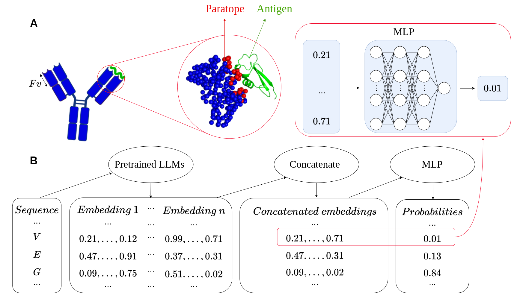

<h1 align="center">
  
</h1>

**Paraplume** is a sequence-based paratope prediction method. It predicts which amino acids in an antibody sequence are likely to interact with an antigen during binding.

Concretely, given an amino acid sequence, the model returns a **probability for each residue** indicating the likelihood of antigen interaction.

Example:
**Y C A S Y W :arrow_right: 0.12 0.03 0.06 0.87 0.97 0.18**

---

### How it works

Paraplume uses supervised learning and involves three main steps:

1. **Labelling**:
   Antibody sequences are annotated with paratope labels using structural data from [SAbDab](http://opig.stats.ox.ac.uk/webapps/newsabdab/).

2. **Sequence representation**:
   Each amino acid is embedded into a high-dimensional vector using **Protein Language Model (PLM) embeddings**.

3. **Model training**:
   A **Multi-Layer Perceptron (MLP)** is trained to minimize **Binary Cross-Entropy Loss**, using PLM embeddings as inputs and paratope labels as targets.

---

### Model Overview

The full workflow of Paraplume is summarized in the figure below:

---
### Installation
It is available on PyPI and can be installed through pip:
`pip install paraplume`
We recommand to install it in a virtual environment with python >= 3.10

---
### Inputs

---
### Command line paratope inference

---
### Paratope inference in a python script
